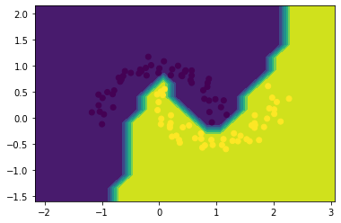

# littlegrad

This is a small autograd engine built from following a tutorial taught by Andrej Karpathy himself. 

Backpropagation is implemented over a dynamic acyclic graph, which makes you think about Neural Nets in a different light.

Since the engine itself is quite limited, operations need to be split into the most elementary of operations.

## autodifferentiation at work

```python
from engine import Value

a = Value(2.0)
b = Value(-3.0)
c = a * b
d = Value(5.0)
e = c + d**2
f = e / 2
print(f'{f.data:.4f}') # prints result of forward pass: 9.5000
f.backward()
print(f'{a.grad:.4f}') # prints df/da : -1.5000
print(f'{d.grad:.4f}') # prints df/dd : 5.0000
```

## the key to it all

each operation that is implemented in the engine will "store"
a function to compute the gradient within the result of each operation, this allows for the local gradients to be chained
to build up a produce the global gradient for each variable.

```python
    def __add__(self, other):
        # if other is not Value object, wrap it to be a Value object.
        other = other if isinstance(other, Value) else Value(other)
        out = Value(self.data + other.data, children=(self, other), op='+')

        def _backward():
            # the resulting node of every operation will store a function to compute the gradient with respect to that operation
            # and chain that "local" gradient with the gradient computed from operations after it.
            self.grad += 1.0 * out.grad
            other.grad += 1.0 * out.grad
        out._backward = _backward       

        return out
```

## testing it out

The engine is tested out in `engine_test.ipynb` by training a small MLP powered by the engine on a made-up moons dataset from scikit-learn. As it turns out, it works great.


